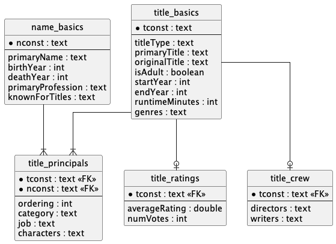

# Lunatech IMDB IRL Assessment

## Development and Testing

To run the application use:

```bash
./mvnw mn:run
```

To test the application use:

```bash
./mvnw test
```


## Domain

The domain of this assessment consists of a few classes, supported by their
respective tables:

- `Person`: Represents a person who participated in a film, or tv series. This
  includes actors, actresses, producers, etc.
- `Title`: Represents a title, like a film or a tv series.
- `Cast`: Represents a `Person` who worked in a film or a tv series.
- `Rating`: Represents how is a title rated (is it good? is it terrible?)
- `Genre`: A title can have one or more genres (eg. `Action`, `Horror`, etc.)
- `TitleType`: A title can have one type (e.g. `Movie`, `TvSeries`, etc.)

A `Crew` is only available as a DTO.


## Database Schema

The database [schema](./docs/schema.sql) is composed of 5 tables:

- `name_basics`: All the people that have worked on films, or tv series. This
  includes actors, actresses, producers, etc.
- `title_basics`: All the title films, or tv series.
- `title_principals`: Many-to-many table relating titles with people.
- `title_crew`: Contains the directors and the writers for a given title.
- `title_ratings`: Contains the average rating, and the amount of votes, for
  a given title.




## Endpoints Available

The API already offers some REST endpoints:

### People's Endpoints

- `GET /people/{id}`: Fetches a `Person` from the database.
- `GET /people/{id}/known-for-titles`: Fetches a short list of `Title`s that a person worked on.

### Title's Endpoints

- `GET /titles/top-rated?genre={genre}`: Returns the top 10 rated movies by genre.
- `GET /titles/{id}`: Fetches a `Title` from the database.
- `GET /titles/{id}/cast`: Fetches a `Title`'s cast from the database.
- `GET /titles/{id}/crew`: Fetches a `Title`'s crew from the database.
- `GET /titles/{id}/rating`: Fetches a `Title`'s rating from the database.
